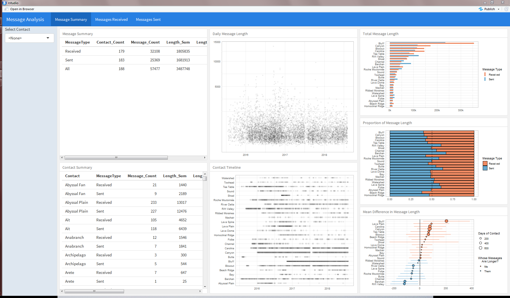

# SMS Analysis
With this project, I analyze thousands of messages from hundreds of contacts.

SMS messages are exported from Android via the app *SMS Backup and Restore*.  Contact names have been obfuscated, and actual message content is not made public.  

The app exports the SMS messages in XML format. This is my starting point.  I have three R scripts dedicated to:

1. Importing raw XML data and joining it with a prior snapshot of SMS messages.
2. Summarizing the data in many formats and contexts.
3. Visualizing the summarized data.  

There currently is no text analysis in this project.

I am working on building an R Markdown Flexdashboard to allow a user to dig through the results.

